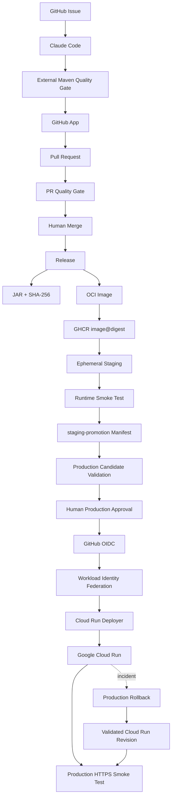
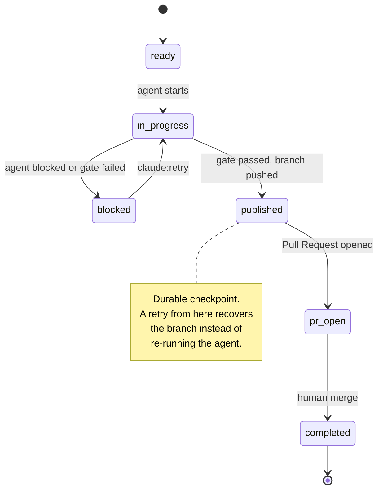
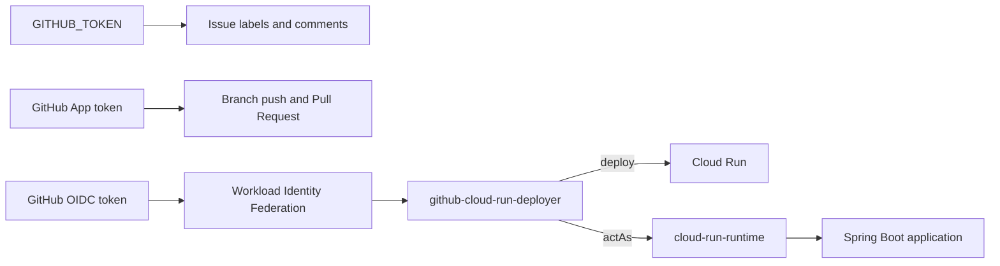

<div align="center">

# Pipeline Orchestrated

**Un agente de IA escribe el cambio. Una infraestructura determinista decide si llega a producción.**

[](https://github.com/RodolGiaco/pipeline-orchestrated/actions/workflows/pr-ci.yml)
[](https://github.com/RodolGiaco/pipeline-orchestrated/actions/workflows/release.yml)
[](https://github.com/RodolGiaco/pipeline-orchestrated/actions/workflows/staging.yml)
[](https://github.com/RodolGiaco/pipeline-orchestrated/actions/workflows/production.yml)


[](LICENSE)

[English](README.md) · [Español](README.es.md)

</div>

---

## Índice

- [Descripción general](#descripción-general)
- [Demo](#demo)
- [Características](#características)
- [Stack tecnológico](#stack-tecnológico)
- [Arquitectura](#arquitectura)
- [Estructura del proyecto](#estructura-del-proyecto)
- [Puesta en marcha](#puesta-en-marcha)
- [API](#api)
- [Configuración](#configuración)
- [Decisiones técnicas](#decisiones-técnicas)
- [Documentación](#documentación)
- [Licencia](#licencia)
- [Autor](#autor)

---

## Descripción general

Los agentes de IA son buenos produciendo cambios y malos haciéndose responsables de ellos. Un
agente que informa "listo" está emitiendo un juicio sobre su propio trabajo, y un pipeline que
confía en ese juicio no tiene un control de calidad real: tiene la opinión de un modelo.

Este repositorio es una respuesta concreta a ese problema. Claude Code implementa cambios a
partir de un GitHub Issue con un conjunto de permisos restringido, y todo lo que ocurre después
pertenece a una infraestructura que el agente no puede alcanzar: un control de calidad externo
basado en Maven decide si la implementación es aceptable, una GitHub App publica la rama y el
Pull Request, una ejecución de CI independiente valida el resultado y una persona hace el merge.
A partir de ahí el artefacto se construye una sola vez y se promueve —nunca se reconstruye— a
través de staging hasta producción, donde una segunda aprobación humana y credenciales federadas
de corta duración se interponen entre el cambio y el tráfico real.

El servicio Spring Boot que está en el centro es deliberadamente mínimo: un único endpoint de
estado. La sustancia de ingeniería está en el sistema de entrega que lo rodea: límites de
permisos, validación determinista, promoción inmutable, separación de identidades y un camino de
recuperación probado.

> **La invariante:** producción ejecuta un artefacto previamente validado, identificado de forma
> inmutable, aprobado explícitamente y recuperable operativamente.

---

## Demo

> Cada bloque marca una captura o GIF a agregar. Poné el archivo en la ruta indicada y
> descomentá la línea de imagen que está debajo.

### 1. El ciclo del agente, de punta a punta

> **Agregar:** `docs/assets/demo-issue-to-pr.png`
> Un GitHub Issue etiquetado `claude:ready`, junto al Pull Request que la automatización abrió a
> partir de él. Si se ve la progresión de etiquetas en la línea de tiempo del Issue, mejor. Es la
> imagen más convincente del proyecto: usá la mejor ejecución que tengas.

<!--  -->

### 2. La cadena de promoción

> **Agregar:** `docs/assets/demo-promotion-chain.png`
> La pestaña Actions mostrando Release, Staging y Production como ejecuciones consecutivas
> disparadas por `workflow_run`, las tres en verde. Un GIF recorriendo los tres resúmenes de
> ejecución funciona muy bien acá.

<!--  -->

### 3. La compuerta humana

> **Agregar:** `docs/assets/demo-production-approval.png`
> El diálogo "Review deployments" del entorno production, junto al resumen del job Prepare
> Production Promotion que lista el digest de imagen y el checksum del JAR validados. Muestra a
> un operador aprobando un candidato conocido, no un deploy a ciegas.

<!--  -->

### 4. El servicio corriendo

> **Agregar:** `docs/assets/demo-live-endpoint.png`
> Una terminal con `curl` contra la URL real de Cloud Run, devolviendo `"environment": "production"`.
> Demuestra que el pipeline termina en algo real.

<!--  -->

---

## Características

- 🤖 **Implementación dirigida por Issues** — etiquetar un Issue como `claude:ready` inicia al
  agente; el propio Issue transporta el estado de la tarea hasta su finalización.
- 🔒 **Superficie restringida del agente** — `.claude/settings.json` le permite leer y editar
  únicamente `src/` y `pom.xml`, y le deniega `git push`, `commit`, `merge`, `gh`, `rm`, `curl` y
  `sudo`. Hooks de ejecución aplican ese límite en cada llamada a herramientas.
- ✅ **Control de calidad fuera del agente** — `./mvnw -B -ntp verify` se ejecuta por separado y
  produce el veredicto autoritativo. Una tarea completada con un build fallido es un Issue
  bloqueado.
- 🔑 **Pull Requests automatizados mediante una GitHub App** — la publicación de rama y PR usa un
  token de instalación de corta duración, distinto del `GITHUB_TOKEN` que gestiona el ciclo de
  vida del Issue.
- 📦 **Construir una vez, promover el mismo artefacto** — el JAR, su SHA-256 y el digest de la
  imagen OCI se producen una sola vez en release y viajan sin cambios por todos los entornos.
- 🧪 **Staging efímero** — la imagen de release corre como contenedor real y debe responder un
  smoke test HTTP en vivo antes de poder generar el manifiesto de promoción.
- ☁️ **Despliegue cloud sin llaves** — GitHub se autentica contra Google Cloud mediante OIDC y
  Workload Identity Federation. En este repositorio no existe ninguna clave JSON de service
  account.
- 👤 **Aprobación humana antes de producción** — el operador aprueba un candidato que ya fue
  validado, no una solicitud de despliegue sin verificar.
- ↩️ **Rollback como workflow de primera clase** — la recuperación reasigna el tráfico de Cloud
  Run a una revisión validada, con la misma compuerta de aprobación y su propio smoke test.
  Nunca reconstruye.
- 🧾 **Trazable por construcción** — todo despliegue en producción se puede rastrear hacia atrás
  por revisión, digest de imagen, checksum del JAR, commit de merge, Pull Request e Issue.
- 🔁 **Punto de recuperación durable** — la etiqueta `claude:published` registra que una
  implementación válida ya llegó a la rama remota, de modo que un reintento retoma en lugar de
  volver a ejecutar al agente.

---

## Stack tecnológico

| Tecnología | Versión | Rol en el proyecto |
|---|---|---|
| Java | 21 | Lenguaje de la aplicación |
| Spring Boot | 4.1.1 | Framework web y soporte de tests del servicio de estado |
| Maven Wrapper | 3.9.16 | Punto único de entrada al build; fija la construcción para CI y para quien desarrolla |
| Claude Code | 2.1.259 | Agente de implementación, ejecutado headless con un resultado restringido por JSON Schema |
| GitHub Actions | — | Orquestación de cada etapa: validación, release, promoción, despliegue y rollback |
| GitHub App | — | Identidad de corta duración para publicar ramas y Pull Requests |
| Docker / OCI | `eclipse-temurin:21-jre` | Imagen de ejecución, corriendo con un usuario sin privilegios |
| GitHub Container Registry | — | Almacenamiento inmutable de artefactos, direccionados por digest |
| Google Cloud Run | — | Runtime de producción con revisiones inmutables y control de tráfico |
| OIDC + Workload Identity Federation | — | Autenticación sin llaves y de corta duración entre GitHub y Google Cloud |
| Google IAM | — | Autorización, con identidades separadas de despliegue y de ejecución |
| GitHub Environments | — | Compuerta de aprobación humana para producción |
| Mermaid | — | Diagramas de arquitectura renderizados nativamente por GitHub |

---

## Arquitectura

### Flujo de entrega

Del Issue al tráfico real. Cada flecha que cruza hacia una etapa nueva es un punto de control.



### Ciclo de vida del Issue

El Issue es la máquina de estados. `claude:published` es el punto de control durable que hace
que un reintento sea recuperable en lugar de repetitivo.



### Límites de identidad

Ninguna credencial abarca el pipeline entero. Autenticación, autorización y gobernanza humana se
resuelven con tres mecanismos distintos.



La aplicación en ejecución nunca hereda privilegios de despliegue. Los límites de confianza, la
cadena de custodia del artefacto y el modelo completo de promoción están en
[`docs/ARCHITECTURE.md`](docs/ARCHITECTURE.md) (en inglés).

---

## Estructura del proyecto

```text
.
├── .claude/                          # Política de ejecución del agente de implementación
│   ├── hooks/                        #   Guardas evaluadas en cada llamada a herramientas
│   ├── schemas/                      #   JSON Schema que el resultado del agente debe cumplir
│   ├── scripts/                      #   Wrapper de invocación headless del agente
│   └── settings.json                 #   Permisos: qué puede leer, editar y ejecutar el agente
├── .github/
│   ├── ISSUE_TEMPLATE/               # Plantilla de tarea que consume el workflow del agente
│   └── workflows/                    # Los ocho workflows del pipeline
├── docs/
│   ├── ARCHITECTURE.md               # Límites de confianza, identidades, modelo de promoción
│   └── OPERATIONS_RUNBOOK.md         # Operación diaria, diagnóstico y procedimiento de rollback
├── scripts/
│   ├── ci/run-task.sh                # Agente + control de calidad colapsados en un exit code
│   └── local/run-task.sh             # El mismo pipeline, ejecutable en una máquina local
├── src/
│   ├── main/java/com/claude/cicd/api/
│   │   ├── CicdApiApplication.java   #   Punto de entrada de Spring Boot
│   │   └── status/                   #   Endpoint de estado y su payload de respuesta
│   ├── main/resources/               #   Configuración de la aplicación
│   └── test/java/                    #   Suite de tests detrás del control de calidad
├── .env.local.example                # Plantilla de configuración local del agente
├── CLAUDE.md                         # Reglas del proyecto que el agente debe respetar
├── Dockerfile                        # Imagen de ejecución: JRE 21, usuario sin privilegios
├── mvnw                              # Maven Wrapper — punto único de entrada al build
└── pom.xml
```

### Workflows

| Workflow | Responsabilidad |
|---|---|
| `claude-issue.yml` | Ejecuta el agente desde un Issue etiquetado, valida el resultado y publica la rama y el Pull Request |
| `pr-ci.yml` | Control de calidad independiente del Pull Request |
| `claude-merged.yml` | Cierra el ciclo de vida del Issue después del merge |
| `release.yml` | Verifica, construye el JAR y su checksum, y publica la imagen OCI |
| `staging.yml` | Ejecuta la imagen de release, le hace smoke test y produce el manifiesto de promoción |
| `production.yml` | Valida el candidato, pide aprobación, se autentica por OIDC y despliega en Cloud Run |
| `production-rollback.yml` | Reasigna el tráfico de producción a una revisión validada |
| `claude-task.yml` | Ejecuta el agente manualmente para diagnóstico, fuera del ciclo de entrega |

---

## Puesta en marcha

### Requisitos previos

| Requisito | Necesario para |
|---|---|
| Java 21 | Construir y ejecutar el servicio |
| Docker | Ejecutar la imagen del contenedor localmente |
| GitHub CLI (`gh`) | Disparar el workflow de rollback |
| Google Cloud CLI (`gcloud`) | Inspeccionar revisiones y tráfico de Cloud Run |

No hace falta instalar Maven: el repositorio incluye el Maven Wrapper.

### 1. Clonar el repositorio

```bash
git clone https://github.com/RodolGiaco/pipeline-orchestrated.git
cd pipeline-orchestrated
```

### 2. Ejecutar el control de calidad

Es el comando de build autoritativo, idéntico al que ejecuta CI:

```bash
./mvnw -B -ntp verify
```

### 3. Levantar el servicio

```bash
./mvnw spring-boot:run
```

### 4. Verificar que está arriba

```bash
curl -s http://localhost:8080/api/v1/status
```

```json
{
  "status": "UP",
  "version": "0.0.1-SNAPSHOT",
  "environment": "local"
}
```

### Ejecutar el contenedor localmente

Construí el JAR, copiálo donde el Dockerfile lo espera, y después construí y ejecutá la imagen:

```bash
./mvnw -B -ntp verify

mkdir -p dist
cp target/claude-cicd-api-*.jar dist/app.jar

docker build --build-arg JAR_FILE=dist/app.jar -t pipeline-orchestrated:local .
docker run --rm -p 8080:8080 -e APP_ENVIRONMENT=docker pipeline-orchestrated:local
```

```bash
curl -s http://localhost:8080/api/v1/status
```

El campo `environment` ahora informa `docker`, lo que confirma que el entorno de despliegue se
inyecta en tiempo de ejecución en lugar de quedar horneado en la imagen.

### Ejecutar el agente localmente

Para reproducir en tu propia máquina el mismo pipeline de agente más control de calidad que
ejecuta CI:

```bash
cp .env.local.example .env.local
echo "Add a health check to the status endpoint." | ./scripts/local/run-task.sh
```

El script emite el mismo contrato JSON de resultado que CI y termina con `0` cuando el agente y
el control de calidad tienen éxito, `10` cuando el agente se declara bloqueado, `20` ante una
falla del agente y `30` cuando el agente completó pero el control de calidad rechazó la
implementación.

---

## API

| Método | Endpoint | Descripción | Éxito |
|---|---|---|---|
| `GET` | `/api/v1/status` | Informa disponibilidad, versión del artefacto y entorno de despliegue | `200 OK` |

**Respuesta**

```json
{
  "status": "UP",
  "version": "0.0.1-SNAPSHOT",
  "environment": "production"
}
```

| Campo | Origen | Descripción |
|---|---|---|
| `status` | Constante | `"UP"` mientras el servicio atiende tráfico |
| `version` | `build.version`, filtrado desde `pom.xml` en tiempo de build | Identifica el artefacto en ejecución |
| `environment` | `APP_ENVIRONMENT`, por defecto `local` | Identifica dónde se está ejecutando el artefacto |

Este endpoint es el objetivo del smoke test de los workflows de staging, producción y rollback.
Los tres exigen que `status` sea `"UP"` antes de dar un despliegue por exitoso, lo que lo
convierte en el punto más acotado donde el pipeline puede detectar que un artefacto promovido en
realidad no corre.

---

## Configuración

### Tiempo de ejecución

| Variable | Valor por defecto | Descripción |
|---|---|---|
| `APP_ENVIRONMENT` | `local` | Lo informa el endpoint de estado. `staging.yml` la fija en `staging` y `production.yml` en `production` |

### Variables del repositorio

| Variable | Descripción |
|---|---|
| `GCP_PROJECT_ID` | Proyecto de Google Cloud que aloja el servicio |
| `GCP_REGION` | Región de Cloud Run |
| `GCP_SERVICE_ACCOUNT` | Identidad de despliegue asumida mediante Workload Identity Federation |
| `GCP_RUNTIME_SERVICE_ACCOUNT` | Identidad con la que corre el servicio en Cloud Run |
| `GCP_WORKLOAD_IDENTITY_PROVIDER` | Nombre del recurso del proveedor de Workload Identity |
| `GCP_CLOUD_RUN_SERVICE` | Nombre del servicio de Cloud Run |
| `CLAUDE_AUTOMATION_APP_CLIENT_ID` | Client ID de la GitHub App que publica ramas y Pull Requests |
| `USE_OPENROUTER` | Selecciona el proveedor de modelo del agente. `false` usa el modelo Claude por defecto; `true` enruta por OpenRouter |

### Secretos del repositorio

| Secreto | Descripción |
|---|---|
| `CLAUDE_CODE_OAUTH_TOKEN` | Autenticación del agente |
| `CLAUDE_AUTOMATION_APP_PRIVATE_KEY` | Clave privada de la GitHub App |
| `OPENROUTER_API_KEY` | Se lee únicamente cuando `USE_OPENROUTER` es `true` |

No hay ninguna credencial de Google Cloud de larga duración almacenada en este repositorio. El
acceso a la nube se obtiene por ejecución mediante OIDC.

### Configuración local del agente

`scripts/local/run-task.sh` lee `.env.local`, que está excluido de Git. Copiá
`.env.local.example` para crearlo. Las credenciales de OpenRouter se cargan desde
`~/.config/claude-code/openrouter.env`, fuera del repositorio.

---

## Decisiones técnicas

### El agente implementa; no decide

Claude Code no tiene ningún camino hacia `main`. No puede hacer commit, push, abrir un Pull
Request, mergear ni desplegar. Eso lo impone el conjunto de permisos de `.claude/settings.json` y
un hook `PreToolUse`, no una instrucción en un prompt. Todo lo posterior a la implementación le
pertenece a GitHub Actions.

La razón es simple: un agente que valida su propio trabajo no aporta una señal independiente. Al
separar el resultado del agente de `./mvnw -B -ntp verify`, una tarea completada y una
implementación aceptada pasan a ser dos hechos distintos, y solo el segundo puede publicar
código.

### La publicación usa una GitHub App, no el token del workflow

Un Pull Request creado con `GITHUB_TOKEN` no dispara otros workflows, lo que dejaría a los PR
automatizados sin un control de calidad independiente, o exigiría un clic manual de "approve
workflows" en cada ejecución. Un token de instalación de GitHub App resuelve ambas cosas: es de
corta duración, tiene alcance exacto a `contents: write` y `pull-requests: write`, y los PR que
abre disparan `pr-ci.yml` con normalidad. Además mantiene las operaciones sobre el ciclo de vida
del Issue en una credencial separada.

### El artefacto se construye una sola vez

Staging y producción consumen la misma imagen OCI, direccionada por digest. Entre entornos no se
reconstruye nada, así que "pasó staging" es una afirmación sobre los bytes exactos que van a
atender el tráfico de producción. El manifiesto de promoción lleva hacia adelante el commit de
release, el digest de la imagen y el checksum del JAR, y producción vuelve a verificar los tres
contra las etiquetas de la imagen antes de desplegar. Cualquier discrepancia bloquea el
despliegue.

### La aprobación ocurre después de la validación, no antes

La compuerta de aprobación de producción está detrás de la validación del candidato. Para cuando
se le pide a un operador que apruebe, el manifiesto ya fue verificado, el digest ya fue
comprobado y el artefacto ya corrió y respondió una petición HTTP en staging. La persona confirma
un candidato conocido en vez de autorizar una solicitud sin verificar, que es la diferencia entre
una aprobación con sentido y un sello de goma.

### Las credenciales de nube son federadas, no almacenadas

Producción se autentica mediante GitHub OIDC y Workload Identity Federation, por lo que no existe
ninguna clave JSON de service account en el repositorio ni en sus secretos. Las identidades de
despliegue y de ejecución también están separadas: `github-cloud-run-deployer` despliega y actúa
como (`actAs`) la identidad de ejecución, mientras que `cloud-run-runtime` ejecuta la aplicación
sin permisos de despliegue. Comprometer el servicio en ejecución no otorga la capacidad de
desplegar.

### La recuperación es un workflow, no una página de wiki

El rollback está implementado como `production-rollback.yml`. Valida que la revisión solicitada
pertenezca al servicio esperado, exige la misma aprobación de producción, mueve el tráfico con
`gcloud run services update-traffic` y ejecuta un smoke test posterior. Nunca reconstruye, así
que la recuperación no introduce ningún artefacto nuevo; y como comparte grupo de concurrencia
con `production.yml`, un rollback y un despliegue nunca pueden competir entre sí.

### El pipeline falla cerrado

La ambigüedad nunca se trata como éxito. Un control de calidad fallido, un manifiesto
inconsistente, una discrepancia de identidad del artefacto, un intercambio OIDC fallido o un
smoke test que no devuelve `UP` detienen la promoción en lugar de degradarla.

---

## Documentación

| Documento | Contenido |
|---|---|
| [`docs/ARCHITECTURE.md`](docs/ARCHITECTURE.md) | Límites de responsabilidad, ciclo de vida del Issue, validación determinista, modelo de release y promoción, OIDC/WIF, identidades y revisiones de Cloud Run, rollback, límites de confianza y cadena de custodia del artefacto |
| [`docs/OPERATIONS_RUNBOOK.md`](docs/OPERATIONS_RUNBOOK.md) | Verificación de producción, inspección de revisiones, procedimiento de rollback, diagnóstico de release/staging/producción, resolución de problemas de OIDC y de la GitHub App, concurrencia y reglas de seguridad operativa |
| [`CLAUDE.md`](CLAUDE.md) | Las reglas del proyecto que el agente de implementación debe respetar |

> La documentación extendida se mantiene en inglés, en línea con el idioma del código y de los
> workflows.

---

## Licencia

Publicado bajo la [Licencia MIT](LICENSE).

---

## Autor

**Rodolfo Giacomodonatto**

Backend engineer enfocado en Java, Spring Boot, arquitectura CI/CD e infraestructura cloud.

- GitHub — [@RodolGiaco](https://github.com/RodolGiaco)
- LinkedIn — [Rodolfo Giacomodonatto](https://www.linkedin.com/in/rodolfo-giacomodonatto)
