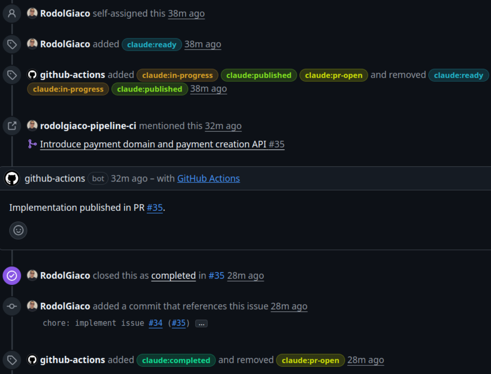
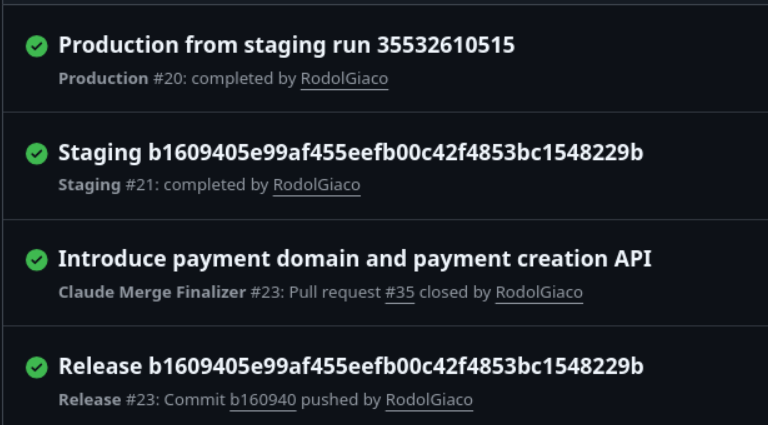
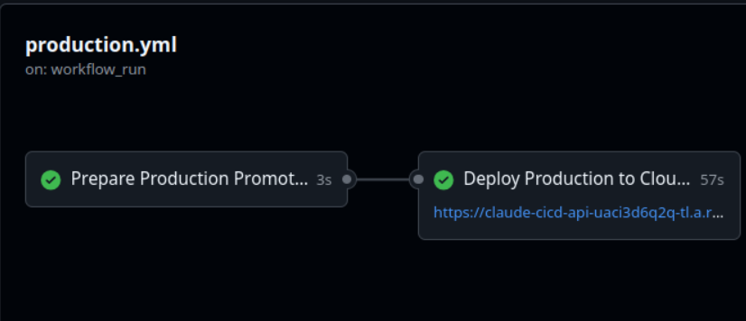
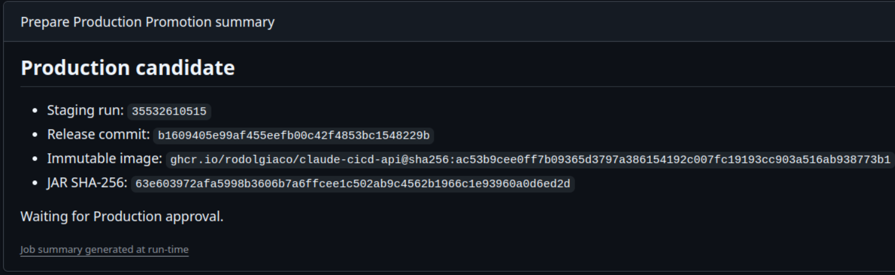
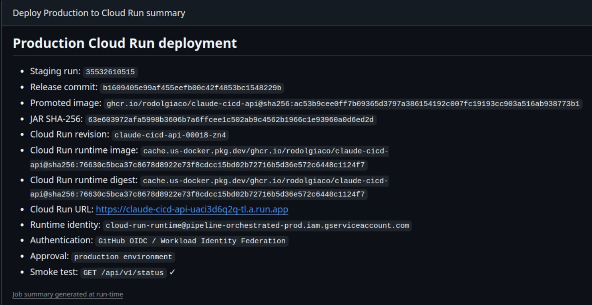
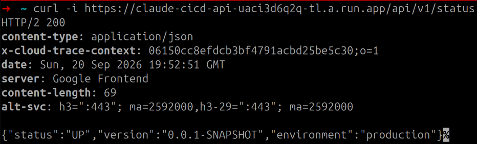
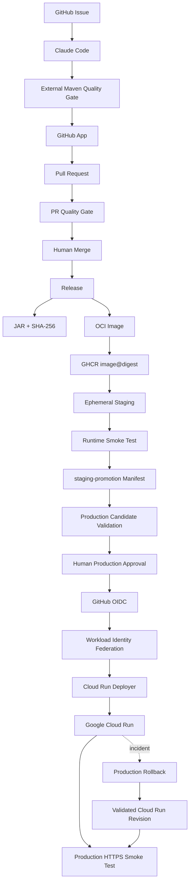
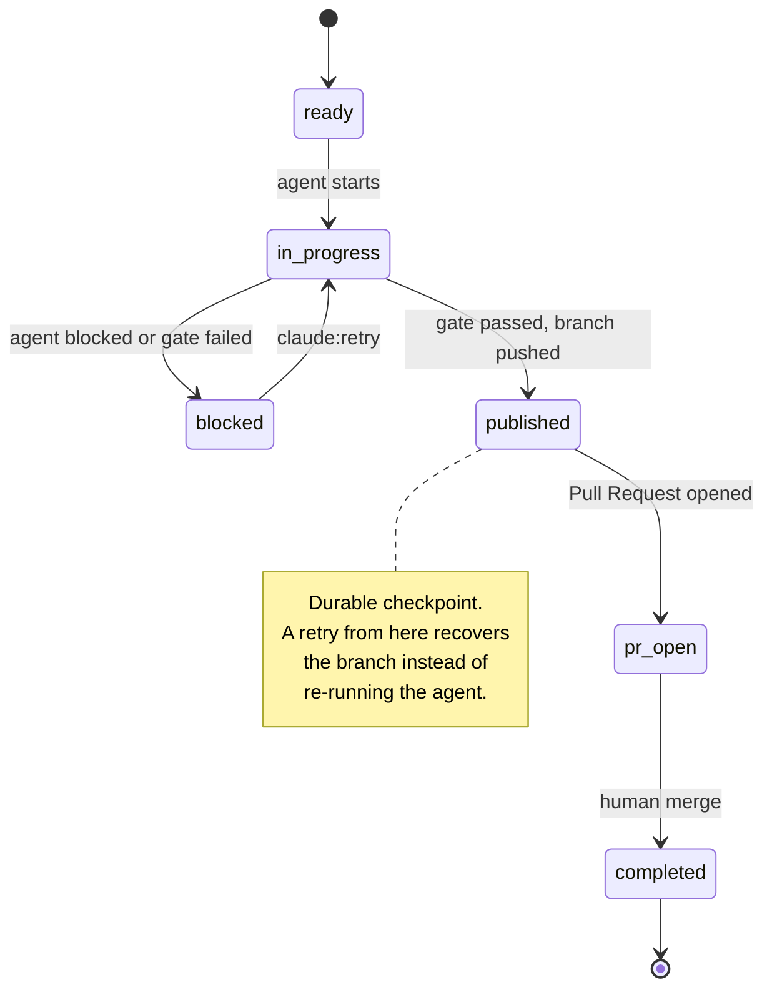
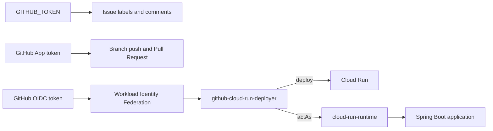

<div align="center">

# Pipeline Orchestrated

**An AI coding agent writes the change. Deterministic infrastructure decides whether it reaches production.**

[](https://github.com/RodolGiaco/pipeline-orchestrated/actions/workflows/pr-ci.yml)
[](https://github.com/RodolGiaco/pipeline-orchestrated/actions/workflows/release.yml)
[](https://github.com/RodolGiaco/pipeline-orchestrated/actions/workflows/staging.yml)
[](https://github.com/RodolGiaco/pipeline-orchestrated/actions/workflows/production.yml)


[](LICENSE)

[English](README.md) · [Español](README.es.md)

</div>

---

## Table of Contents

- [Overview](#overview)
- [Demo](#demo)
- [Features](#features)
- [Tech Stack](#tech-stack)
- [Architecture](#architecture)
- [Project Structure](#project-structure)
- [Getting Started](#getting-started)
- [API](#api)
- [Configuration](#configuration)
- [Technical Decisions](#technical-decisions)
- [Documentation](#documentation)
- [License](#license)
- [Author](#author)

---

## Overview

AI coding agents are good at producing changes and bad at being accountable for them. An agent
that reports "done" is making a claim about its own work, and a delivery pipeline that trusts
that claim has no real quality gate — it has a model's opinion.

This repository is a working answer to that problem. Claude Code implements changes from a
GitHub Issue under a restricted permission set, and everything that follows is owned by
infrastructure the agent cannot reach: an external Maven gate decides whether the
implementation is acceptable, a GitHub App publishes the branch and Pull Request, an
independent CI run validates the result, and a human merges. From there the artifact is built
once and promoted — never rebuilt — through staging into production, where a second human
approval and short-lived federated cloud credentials stand between the change and live traffic.

The Spring Boot service at the center is deliberately small: a single status endpoint. The
engineering substance is the delivery system around it — permission boundaries, deterministic
validation, immutable promotion, identity separation, and a tested recovery path.

> **The invariant:** production runs an artifact that was previously validated, immutably
> identified, explicitly approved, and operationally recoverable.

---

## Demo

### 1. The agent loop, end to end

An Issue labeled `claude:ready` starts the agent, and the automation carries the task through the
full label lifecycle — `in-progress`, `published`, `pr-open`, `completed` — publishing the
implementation as a Pull Request on the way.



### 2. The promotion chain

A merge into `main` triggers Release, which chains into Staging and then Production through
`workflow_run`. Each stage validates the artifact produced by the one before it.



### 3. The human gate

Production is split into two jobs. The first validates the candidate, the second deploys it, and
the environment approval sits between them.



By the time approval is requested, the image digest and the JAR checksum have already been
verified against the promotion manifest. The operator approves a known candidate.



### 4. Deployment evidence

Every deployment records its chain of custody: staging run, release commit, promoted image digest,
JAR checksum, Cloud Run revision, runtime identity, authentication method, and smoke test result.



### 5. The running service

The deployed revision answers over HTTPS and reports the environment it was deployed to.



---

## Features

- 🤖 **Issue-driven implementation** — labeling an Issue `claude:ready` starts the agent; the
  Issue itself carries the task state through to completion.
- 🔒 **A restricted agent surface** — `.claude/settings.json` allows the agent to read and edit
  only `src/` and `pom.xml`, and denies `git push`, `commit`, `merge`, `gh`, `rm`, `curl` and
  `sudo`. Runtime hooks enforce the boundary on every tool call.
- ✅ **A quality gate outside the agent** — `./mvnw -B -ntp verify` runs separately from the
  agent and produces the authoritative verdict. A completed agent result with a failing build
  is a blocked Issue.
- 🔑 **Automated Pull Requests through a GitHub App** — branch and PR publication uses a
  short-lived installation token, separate from the `GITHUB_TOKEN` used for Issue lifecycle.
- 📦 **Build once, promote the same artifact** — the JAR, its SHA-256, and an OCI image digest
  are produced once at release and carried unchanged through every environment.
- 🧪 **Ephemeral staging** — the release image runs as a real container and must answer a live
  HTTP smoke test before it can produce a promotion manifest.
- ☁️ **Keyless cloud deployment** — GitHub authenticates to Google Cloud through OIDC and
  Workload Identity Federation. No service account JSON key exists in this repository.
- 👤 **Human approval before production** — the operator approves a candidate that has already
  been validated, not an unverified deployment request.
- ↩️ **Rollback as a first-class workflow** — production recovery reassigns Cloud Run traffic to
  a validated revision, with the same approval gate and its own smoke test. It never rebuilds.
- 🧾 **Traceable by construction** — every production deployment resolves back through revision,
  image digest, JAR checksum, merge commit, Pull Request, and Issue.
- 🔁 **Durable recovery checkpoint** — the `claude:published` label records that a valid
  implementation already reached the remote branch, so a retry resumes instead of re-running
  the agent.

---

## Tech Stack

| Technology | Version | Role in the project |
|---|---|---|
| Java | 21 | Application language |
| Spring Boot | 4.1.1 | Web framework and test harness for the status service |
| Maven Wrapper | 3.9.16 | The single build entry point; pins the build for CI and developers alike |
| Claude Code | 2.1.259 | Implementation agent, run headless with a JSON Schema-constrained result |
| GitHub Actions | — | Orchestration of every stage: validation, release, promotion, deployment, rollback |
| GitHub App | — | Short-lived identity for branch and Pull Request publication |
| Docker / OCI | `eclipse-temurin:21-jre` | Runtime image, executed as a non-root user |
| GitHub Container Registry | — | Immutable artifact storage, addressed by digest |
| Google Cloud Run | — | Production runtime with immutable revisions and traffic control |
| OIDC + Workload Identity Federation | — | Keyless, short-lived authentication from GitHub to Google Cloud |
| Google IAM | — | Authorization, with separate deployer and runtime identities |
| GitHub Environments | — | Human approval gate for production |
| Mermaid | — | Architecture diagrams rendered natively by GitHub |

---

## Architecture

### Delivery flow

From an Issue to live traffic. Every arrow crossing into a new stage is a control point.



### Issue lifecycle

The Issue is the state machine. `claude:published` is the durable checkpoint that makes a retry
resumable rather than repetitive.



### Identity boundaries

No single credential spans the pipeline. Authentication, authorization, and human governance are
solved by three different mechanisms.



The running application never inherits deployment privileges. For trust boundaries, the artifact
chain of custody, and the full promotion model, see [`docs/ARCHITECTURE.md`](docs/ARCHITECTURE.md).

---

## Project Structure

```text
.
├── .claude/                          # Execution policy for the implementation agent
│   ├── hooks/                        #   Guards evaluated on every agent tool call
│   ├── schemas/                      #   JSON Schema the agent result must satisfy
│   ├── scripts/                      #   Headless agent invocation wrapper
│   └── settings.json                 #   Tool permissions: what the agent may read, edit, run
├── .github/
│   ├── ISSUE_TEMPLATE/               # Task template consumed by the agent workflow
│   └── workflows/                    # The eight pipeline workflows
├── docs/
│   ├── ARCHITECTURE.md               # Trust boundaries, identities, promotion model
│   └── OPERATIONS_RUNBOOK.md         # Day-two operations, diagnostics, rollback procedure
├── scripts/
│   ├── ci/run-task.sh                # Agent run + quality gate collapsed into one exit code
│   └── local/run-task.sh             # The same pipeline, runnable on a developer machine
├── src/
│   ├── main/java/com/claude/cicd/api/
│   │   ├── CicdApiApplication.java   #   Spring Boot entry point
│   │   └── status/                   #   Status endpoint and its response payload
│   ├── main/resources/               #   Application configuration
│   └── test/java/                    #   The test suite behind the quality gate
├── .env.local.example                # Template for local agent configuration
├── CLAUDE.md                         # Project rules the agent is required to follow
├── Dockerfile                        # Runtime image: JRE 21, non-root user
├── mvnw                              # Maven Wrapper — the single build entry point
└── pom.xml
```

### Workflows

| Workflow | Responsibility |
|---|---|
| `claude-issue.yml` | Runs the agent from a labeled Issue, validates the result, and publishes the branch and Pull Request |
| `pr-ci.yml` | Independent Pull Request quality gate |
| `claude-merged.yml` | Closes the Issue lifecycle after merge |
| `release.yml` | Verifies, builds the JAR and its checksum, and publishes the OCI image |
| `staging.yml` | Runs the release image, smoke tests it, and produces the promotion manifest |
| `production.yml` | Validates the candidate, requests approval, authenticates via OIDC, and deploys to Cloud Run |
| `production-rollback.yml` | Reassigns production traffic to a validated revision |
| `claude-task.yml` | Runs the agent manually for diagnostics, outside the delivery cycle |

---

## Getting Started

### Prerequisites

| Requirement | Needed for |
|---|---|
| Java 21 | Building and running the service |
| Docker | Running the container image locally |
| GitHub CLI (`gh`) | Triggering the rollback workflow |
| Google Cloud CLI (`gcloud`) | Inspecting Cloud Run revisions and traffic |

Maven itself is not required — the repository ships the Maven Wrapper.

### 1. Clone the repository

```bash
git clone https://github.com/RodolGiaco/pipeline-orchestrated.git
cd pipeline-orchestrated
```

### 2. Run the quality gate

This is the authoritative build command, identical to the one CI runs:

```bash
./mvnw -B -ntp verify
```

### 3. Start the service

```bash
./mvnw spring-boot:run
```

### 4. Verify it is up

```bash
curl -s http://localhost:8080/api/v1/status
```

```json
{
  "status": "UP",
  "version": "0.0.1-SNAPSHOT",
  "environment": "local"
}
```

### Running the container locally

Build the JAR, stage it where the Dockerfile expects it, then build and run the image:

```bash
./mvnw -B -ntp verify

mkdir -p dist
cp target/claude-cicd-api-*.jar dist/app.jar

docker build --build-arg JAR_FILE=dist/app.jar -t pipeline-orchestrated:local .
docker run --rm -p 8080:8080 -e APP_ENVIRONMENT=docker pipeline-orchestrated:local
```

```bash
curl -s http://localhost:8080/api/v1/status
```

The `environment` field now reports `docker`, confirming that the deployment environment is
injected at runtime rather than baked into the image.

### Running the agent locally

To exercise the same agent-plus-quality-gate pipeline that CI runs, on your own machine:

```bash
cp .env.local.example .env.local
echo "Add a health check to the status endpoint." | ./scripts/local/run-task.sh
```

The script emits the same JSON result contract as CI and exits `0` when both the agent and the
quality gate succeed, `10` when the agent reports itself blocked, `20` on an agent failure, and
`30` when the agent completed but the quality gate rejected the implementation.

---

## API

| Method | Endpoint | Description | Success |
|---|---|---|---|
| `GET` | `/api/v1/status` | Reports liveness, the artifact version, and the deployment environment | `200 OK` |

**Response**

```json
{
  "status": "UP",
  "version": "0.0.1-SNAPSHOT",
  "environment": "production"
}
```

| Field | Source | Description |
|---|---|---|
| `status` | Constant | `"UP"` while the service is serving traffic |
| `version` | `build.version`, filtered from `pom.xml` at build time | Identifies the artifact that is running |
| `environment` | `APP_ENVIRONMENT`, defaults to `local` | Identifies where the artifact is running |

This endpoint is the smoke test target for the staging, production, and rollback workflows. All
three require `status` to equal `"UP"` before treating a deployment as successful — which makes
it the narrowest place where the pipeline can detect that a promoted artifact does not actually
run.

---

## Configuration

### Runtime

| Variable | Default | Description |
|---|---|---|
| `APP_ENVIRONMENT` | `local` | Reported by the status endpoint. Set to `staging` by `staging.yml` and `production` by `production.yml` |

### Repository variables

| Variable | Description |
|---|---|
| `GCP_PROJECT_ID` | Google Cloud project hosting the service |
| `GCP_REGION` | Cloud Run region |
| `GCP_SERVICE_ACCOUNT` | Deployment identity assumed through Workload Identity Federation |
| `GCP_RUNTIME_SERVICE_ACCOUNT` | Identity the Cloud Run service runs as |
| `GCP_WORKLOAD_IDENTITY_PROVIDER` | Workload Identity provider resource name |
| `GCP_CLOUD_RUN_SERVICE` | Cloud Run service name |
| `CLAUDE_AUTOMATION_APP_CLIENT_ID` | GitHub App client ID used to publish branches and Pull Requests |
| `USE_OPENROUTER` | Selects the agent model provider. `false` uses the default Claude model; `true` routes through OpenRouter |

### Repository secrets

| Secret | Description |
|---|---|
| `CLAUDE_CODE_OAUTH_TOKEN` | Agent authentication |
| `CLAUDE_AUTOMATION_APP_PRIVATE_KEY` | GitHub App private key |
| `OPENROUTER_API_KEY` | Read only when `USE_OPENROUTER` is `true` |

No long-lived Google Cloud credential is stored anywhere in this repository. Cloud access is
obtained per run through OIDC.

### Local agent configuration

`.env.local` is read by `scripts/local/run-task.sh` and is ignored by Git. Copy
`.env.local.example` to create it. OpenRouter credentials are loaded from
`~/.config/claude-code/openrouter.env`, outside the repository.

---

## Technical Decisions

### The agent implements; it does not decide

Claude Code has no path to `main`. It cannot commit, push, open a Pull Request, merge, or
deploy — this is enforced by the permission set in `.claude/settings.json` and by a `PreToolUse`
hook, not by instructions in a prompt. Everything after implementation belongs to GitHub Actions.

The reason is simple: an agent that validates its own work provides no independent signal. By
separating the agent result from `./mvnw -B -ntp verify`, a completed task and an accepted
implementation become two different facts, and only the second one can publish code.

### Publication uses a GitHub App, not the workflow token

A Pull Request created with `GITHUB_TOKEN` does not trigger other workflows, which would leave
automated PRs without an independent quality gate — or require a manual "approve workflows"
click on every run. A GitHub App installation token solves both: it is short-lived, it is scoped
to exactly `contents: write` and `pull-requests: write`, and the PRs it opens trigger `pr-ci.yml`
normally. It also keeps Issue lifecycle operations on a separate credential.

### The artifact is built once

Staging and production consume the same OCI image, addressed by digest. Nothing is rebuilt
between environments, so "it passed staging" is a statement about the exact bytes that will
serve production traffic. The promotion manifest carries the release commit, the image digest,
and the JAR checksum forward, and production re-verifies all three against the image labels
before deploying. A mismatch blocks the deployment.

### Approval happens after validation, not before

The production approval gate sits behind candidate validation. By the time an operator is asked
to approve, the manifest has been checked, the digest has been verified, and the artifact has
already run and answered an HTTP request in staging. The human is confirming a known candidate
rather than authorizing an unverified request — which is the difference between a meaningful
approval and a rubber stamp.

### Cloud credentials are federated, not stored

Production authenticates through GitHub OIDC and Workload Identity Federation, so no service
account JSON key exists in the repository or in its secrets. Deployment and runtime identities
are also separate: `github-cloud-run-deployer` deploys and `actAs` the runtime identity, while
`cloud-run-runtime` executes the application with no deployment permissions. A compromise of the
running service does not yield the ability to deploy.

### Recovery is a workflow, not a wiki page

Rollback is implemented as `production-rollback.yml`. It validates that the requested revision
belongs to the expected service, requires the same production approval, moves traffic with
`gcloud run services update-traffic`, and runs a post-rollback smoke test. It never rebuilds, so
recovery introduces no new artifact — and because it shares a concurrency group with
`production.yml`, a rollback and a deployment can never race.

### The pipeline fails closed

Ambiguity is never treated as success. A failed gate, an inconsistent manifest, an artifact
identity mismatch, a failed OIDC exchange, or a smoke test that does not return `UP` all stop
the promotion rather than degrade it.

---

## Documentation

| Document | Contents |
|---|---|
| [`docs/ARCHITECTURE.md`](docs/ARCHITECTURE.md) | Responsibility boundaries, Issue lifecycle, deterministic validation, release and promotion model, OIDC/WIF, Cloud Run identities and revisions, rollback, trust boundaries, artifact chain of custody |
| [`docs/OPERATIONS_RUNBOOK.md`](docs/OPERATIONS_RUNBOOK.md) | Production verification, revision inspection, rollback procedure, release/staging/production diagnostics, OIDC and GitHub App troubleshooting, concurrency, operational security rules |
| [`CLAUDE.md`](CLAUDE.md) | The project rules the implementation agent must follow |

---

## License

Released under the [MIT License](LICENSE).

---

## Author

**Rodolfo Giacomodonatto**

Backend engineer working on Java, Spring Boot, CI/CD architecture, and cloud infrastructure.

- GitHub — [@RodolGiaco](https://github.com/RodolGiaco)
- LinkedIn — [Rodolfo Giacomodonatto](https://www.linkedin.com/in/rodolfo-giacomodonatto)
