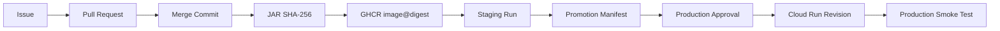

# Pipeline Orchestrated

[](https://github.com/RodolGiaco/pipeline-orchestrated/actions/workflows/pr-ci.yml)
[](https://github.com/RodolGiaco/pipeline-orchestrated/actions/workflows/release.yml)
[](https://github.com/RodolGiaco/pipeline-orchestrated/actions/workflows/staging.yml)
[](https://github.com/RodolGiaco/pipeline-orchestrated/actions/workflows/production.yml)


A production-oriented CI/CD reference project that combines **Claude Code**, **GitHub Actions**, **Spring Boot**, **Docker**, **GitHub Container Registry**, and **Google Cloud Run** into a controlled software delivery pipeline.

The project focuses on a specific engineering problem: **how to let an AI coding agent implement changes while keeping validation, publication, release, deployment, approval, identity, and rollback under deterministic infrastructure control**.

> The agent can implement. It cannot decide that its own implementation is production-ready.

---

## Why This Project Exists

AI coding agents can accelerate implementation, but production delivery still requires deterministic controls around them.

This repository demonstrates a complete delivery model where:

- work starts from a GitHub Issue;
- Claude Code implements the requested change under restricted permissions;
- an external Maven gate validates the implementation;
- a GitHub App publishes the branch and Pull Request;
- Pull Request CI runs independently from the agent;
- a human decides whether the change enters `main`;
- Release produces immutable artifacts;
- Staging validates the exact artifact that can later reach Production;
- Production requires explicit human approval;
- GitHub authenticates to Google Cloud through OIDC and Workload Identity Federation;
- Cloud Run provides the production runtime and revision history;
- rollback reassigns traffic to a known revision without rebuilding the application.

The result is an **agent-assisted but infrastructure-governed delivery pipeline**.

---

## Architecture


The architecture follows a simple invariant:

> **Production must run an artifact that was previously validated, immutably identified, explicitly approved, and operationally recoverable.**

For the detailed architecture and trust boundaries, see [`docs/ARCHITECTURE.md`](docs/ARCHITECTURE.md).

---

## Engineering Highlights

### Agent orchestration with deterministic boundaries

Claude Code is responsible for implementation, not orchestration.

The surrounding automation controls:

- execution context;
- file and command permissions;
- structured agent output;
- branch lifecycle;
- deterministic validation;
- retries and recovery;
- publication;
- promotion;
- deployment.

This prevents the implementation agent from becoming the authority that approves its own work.

### External quality gate

The authoritative validation command is:

```bash
./mvnw -B -ntp verify
```

The pipeline treats the agent result and the deterministic build result as separate signals:

```text
Agent result: completed
        |
        v
External Maven verification
        |
        +--> PASS -> publishable implementation
        |
        +--> FAIL -> blocked
```

### Durable Issue lifecycle

The Claude workflow models work as explicit states:

```text
claude:ready
    |
    v
claude:in-progress
    |
    +--> claude:blocked
    |
    v
claude:published
    |
    v
claude:pr-open
    |
    v
claude:completed
```

`claude:published` acts as a durable recovery checkpoint. If orchestration fails after publication, the workflow can recover without unnecessarily rerunning the agent.

### Automated PRs through a GitHub App

Branches and Pull Requests are published using a short-lived **GitHub App installation token**.

This provides a clean separation between:

- `GITHUB_TOKEN` for Issue lifecycle operations;
- GitHub App credentials for repository publication.

It also allows the automated Pull Request to trigger the independent `PR Quality Gate` without requiring an additional manual workflow approval.

### Immutable release promotion

The Release workflow produces:

- the application JAR;
- the JAR SHA-256 checksum;
- an OCI container image;
- an immutable GHCR image digest;
- OCI metadata linking the image back to the source commit and JAR checksum.

Staging consumes that artifact and produces a `staging-promotion` manifest containing the evidence required by Production.

Production does **not** rebuild the application.

```text
Build once
    |
    v
Release artifact
    |
    +--> Staging validates it
    |
    +--> Production promotes it
```

### Short-lived Google Cloud authentication

Production does not use a long-lived Google Service Account JSON key.

Authentication follows:

```text
GitHub Actions
      |
      v
GitHub OIDC token
      |
      v
Google Workload Identity Federation
      |
      v
Temporary Google credentials
      |
      v
Cloud Run deployment identity
```

Authentication and authorization remain separate:

- **OIDC / WIF** establishes identity;
- **Google IAM** defines what that identity can do;
- **GitHub Environment approval** provides human governance.

### Separate deployer and runtime identities

The Google Cloud deployment identity and application runtime identity are intentionally different.

```text
github-cloud-run-deployer
        |
        | deploy / update
        | actAs
        v
cloud-run-runtime
        |
        v
Spring Boot application
```

The running application does not inherit deployment administration privileges.

### Controlled Production rollback

Production rollback is implemented as a dedicated workflow.

It:

1. validates that the requested Cloud Run revision belongs to the expected service;
2. requires the same Production environment approval;
3. moves 100% of traffic to the selected revision;
4. executes a post-rollback smoke test;
5. leaves an auditable workflow execution.

Rollback is a **traffic operation**, not a rebuild.

---

## CI/CD Flow

### Change lifecycle

```text
Issue
  -> Claude Code
  -> External Quality Gate
  -> GitHub App
  -> Pull Request
  -> PR Quality Gate
  -> Human Merge
```

### Release lifecycle

```text
main
  -> Maven verify
  -> JAR
  -> JAR SHA-256
  -> Docker image
  -> GHCR image@digest
```

### Promotion lifecycle

```text
Release
  -> Ephemeral Staging
  -> Runtime smoke test
  -> Promotion manifest
  -> Candidate validation
  -> Human Production approval
  -> OIDC / WIF
  -> Cloud Run
  -> Production smoke test
```

### Recovery lifecycle

```text
Production incident
  -> Select stable Cloud Run revision
  -> Production Rollback workflow
  -> Human approval
  -> Traffic reassignment
  -> Smoke test
```

---

## Security Model

The project intentionally separates credentials and responsibilities.

| Identity / Credential | Responsibility |
|---|---|
| `GITHUB_TOKEN` | Issue labels, comments, and workflow lifecycle |
| GitHub App installation token | Branch push and Pull Request publication |
| GitHub OIDC token | External identity assertion to Google Cloud |
| `github-cloud-run-deployer` | Cloud Run deployment operations |
| `cloud-run-runtime` | Application runtime identity |

Security controls include:

- least-privilege workflow permissions;
- restricted Claude Code tools and file access;
- runtime hooks that enforce execution invariants;
- no direct agent `git push`, `commit`, `merge`, or Production deployment;
- no long-lived Google Service Account JSON credentials;
- protected `main`;
- required Pull Request quality gate;
- explicit Production approval;
- immutable artifact promotion;
- fail-closed behavior on identity or artifact mismatches;
- controlled rollback with revision validation.

---

## Technology Stack

| Area | Technology |
|---|---|
| Application | Java 21, Spring Boot 4.1.1 |
| Build | Maven Wrapper |
| Agent | Claude Code |
| CI/CD | GitHub Actions |
| Repository automation | GitHub App |
| Containerization | Docker / OCI |
| Container registry | GitHub Container Registry |
| Cloud runtime | Google Cloud Run |
| Cloud authentication | GitHub OIDC + Google Workload Identity Federation |
| Cloud authorization | Google IAM |
| Production governance | GitHub Environments |
| Artifact verification | SHA-256 + OCI metadata |
| Documentation | Markdown + Mermaid |

---

## Repository Structure

```text
.
├── .claude/
│   ├── schemas/
│   ├── scripts/
│   └── settings.json
├── .github/
│   └── workflows/
│       ├── claude-issue.yml
│       ├── claude-merged.yml
│       ├── pr-ci.yml
│       ├── production-rollback.yml
│       ├── production.yml
│       ├── release.yml
│       └── staging.yml
├── docs/
│   ├── ARCHITECTURE.md
│   └── OPERATIONS_RUNBOOK.md
├── scripts/
│   └── ci/
├── src/
│   ├── main/
│   └── test/
├── CLAUDE.md
├── Dockerfile
├── pom.xml
├── mvnw
└── README.md
```

---

## Workflow Responsibilities

| Workflow | Responsibility |
|---|---|
| `claude-issue.yml` | Issue-driven Claude execution, validation, recovery, branch publication, and PR creation |
| `pr-ci.yml` | Independent Pull Request quality gate |
| `claude-merged.yml` | Final Issue lifecycle transition after merge |
| `release.yml` | Maven verification, JAR checksum, artifact publication, and OCI image publication |
| `staging.yml` | Ephemeral runtime validation and promotion manifest generation |
| `production.yml` | Candidate validation, human approval, OIDC/WIF authentication, Cloud Run deployment, and smoke test |
| `production-rollback.yml` | Controlled Cloud Run traffic rollback and validation |

---

## Application Endpoint

The application exposes a simple status endpoint used by CI/CD runtime verification:

```http
GET /api/v1/status
```

Expected minimum response:

```json
{
  "status": "UP"
}
```

The application is intentionally small because the primary scope of the repository is the **software delivery architecture**, not application-domain complexity.

---

## Run Locally

### Requirements

- Java 21
- Docker, only when container execution is required
- GitHub CLI and Google Cloud CLI only for infrastructure operations

### Start the application

```bash
./mvnw spring-boot:run
```

Then verify:

```bash
curl http://localhost:8080/api/v1/status
```

### Run the authoritative quality gate

```bash
./mvnw -B -ntp verify
```

---

## Build the Container Locally

First build the application:

```bash
./mvnw -B -ntp verify
```

Then build the image:

```bash
docker build -t pipeline-orchestrated:local .
```

Run it:

```bash
docker run --rm -p 8080:8080 pipeline-orchestrated:local
```

Verify:

```bash
curl http://localhost:8080/api/v1/status
```

---

## Artifact Traceability

A successful Production deployment can be traced through the complete delivery chain:



Each identifier answers a different question:

- **Git commit SHA** — which source code was accepted?
- **JAR SHA-256** — which Java binary was produced?
- **OCI image digest** — which container image was promoted?
- **Cloud Run revision** — which runtime revision received traffic?

---

## Failure Model

The pipeline is designed to fail closed.

| Failure | Result |
|---|---|
| Claude cannot complete the task | Issue becomes blocked |
| External Maven verification fails | Change is not published |
| PR Quality Gate fails | Merge is blocked |
| Release fails | No Staging promotion |
| Staging runtime validation fails | No Production candidate |
| Promotion manifest is inconsistent | Production is blocked |
| OIDC / WIF authentication fails | No cloud deployment |
| Source artifact metadata mismatches | Production is blocked |
| Cloud Run deployment fails | Deployment is not considered successful |
| Production smoke test fails | Runtime validation fails |
| Post-deployment incident | Controlled rollback to a stable revision |

An ambiguous state is never treated as a successful promotion.

---

## Cloud Run Rollback

Available revisions can be inspected with:

```bash
gcloud run revisions list \
  --service="claude-cicd-api" \
  --region="southamerica-west1"
```

A rollback is initiated through the controlled workflow:

```bash
gh workflow run "Production Rollback" \
  --ref main \
  -f target_revision="<TARGET_REVISION>"
```

The workflow requires Production approval before traffic is changed.

Operational details are documented in [`docs/OPERATIONS_RUNBOOK.md`](docs/OPERATIONS_RUNBOOK.md).

---

## Documentation

### Architecture

[`docs/ARCHITECTURE.md`](docs/ARCHITECTURE.md)

Detailed description of:

- responsibility boundaries;
- Issue lifecycle;
- GitHub App publication;
- deterministic validation;
- Release and immutable promotion;
- OIDC / WIF;
- Cloud Run identities;
- runtime revisions;
- rollback;
- trust boundaries;
- artifact chain of custody.

### Operations Runbook

[`docs/OPERATIONS_RUNBOOK.md`](docs/OPERATIONS_RUNBOOK.md)

Operational procedures for:

- Production verification;
- Cloud Run revision inspection;
- rollback;
- Release diagnostics;
- Staging diagnostics;
- Production diagnostics;
- OIDC / WIF failures;
- GitHub App troubleshooting;
- workflow concurrency;
- security rules.

---

## Key Design Decisions

### GitHub Actions orchestrates; Claude Code implements

Agentic execution remains inside a deterministic orchestration layer.

### Validation happens outside the agent

The final acceptance signal comes from Maven and GitHub Actions, not from the model response.

### Publication uses a GitHub App

Repository publication has its own short-lived identity and triggers normal Pull Request CI behavior.

### Staging and Production use the same artifact

There is no rebuild between environments.

### Production approval happens after candidate validation

The operator approves a known candidate instead of an unverified deployment request.

### Cloud credentials are federated

GitHub Actions obtains temporary Google credentials using OIDC/WIF instead of stored JSON keys.

### Production has a tested recovery path

Rollback is a first-class workflow rather than an emergency command documented after the fact.

---

## What This Project Demonstrates

This repository is primarily a software delivery and platform engineering project.

It demonstrates practical experience with:

- Java and Spring Boot;
- CI/CD architecture;
- GitHub Actions;
- Claude Code orchestration;
- agent permission boundaries;
- deterministic quality gates;
- GitHub Apps;
- branch protection;
- Issue-driven automation;
- workflow recovery and idempotency;
- Docker and OCI images;
- GitHub Container Registry;
- artifact checksums and metadata;
- immutable artifact promotion;
- Google Cloud Run;
- Google IAM;
- OIDC;
- Workload Identity Federation;
- deployment/runtime identity separation;
- human-in-the-loop production governance;
- revision-based rollback;
- operational documentation and runbooks.

---

## Engineering Principles

The project is built around the following principles:

1. **Deterministic validation over agent self-assessment**
2. **Least privilege**
3. **Separation of duties**
4. **Short-lived credentials**
5. **Immutable promotion**
6. **Human approval for high-impact decisions**
7. **Fail-closed automation**
8. **Recoverability**
9. **Traceability**
10. **One canonical Production path**

---

## Project Status

The end-to-end pipeline has been validated through the complete lifecycle:

```text
Issue
  -> Claude implementation
  -> deterministic verification
  -> automated Pull Request
  -> independent PR CI
  -> human merge
  -> Release
  -> Staging
  -> Production approval
  -> Google Cloud authentication
  -> Cloud Run deployment
  -> HTTPS smoke test
  -> controlled rollback
```

The repository includes both architectural documentation and an operational runbook so that the system can be understood and operated independently from its implementation history.

---

## Author

**Rodolfo Giacomodonatto**

Backend Engineer focused on Java, Spring Boot, distributed systems, CI/CD, cloud infrastructure, and production-oriented software delivery.
