# CI/CD Architecture

## Pipeline Orchestrated

This document describes the final production architecture of the `pipeline-orchestrated` project.

The architecture is designed around deterministic validation, immutable artifact promotion, short-lived credentials, explicit human approval points, and recoverable production deployments.

---

## 1. Architectural Goals

The pipeline is designed to guarantee the following properties:

- application changes enter through a controlled Issue lifecycle;
- Claude Code can implement changes but cannot publish directly to Production;
- deterministic validation remains external to the agent;
- automated Pull Requests trigger CI without redundant manual approval;
- `main` remains protected by Pull Request checks;
- Release artifacts are immutable and traceable;
- Staging validates the same artifact later promoted to Production;
- Production requires explicit human approval;
- GitHub authenticates to Google Cloud without long-lived JSON credentials;
- Cloud Run uses a dedicated runtime identity;
- Production can be rolled back to a previous revision without rebuilding;
- every critical transition produces auditable evidence.

---

## 2. High-Level Architecture

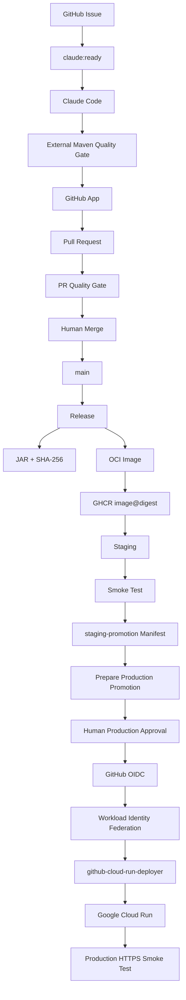

The central architectural rule is:

> Build once, validate once, promote the same immutable artifact.

---

## 3. Source Change Lifecycle

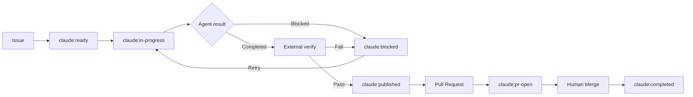

### Durable Checkpoint

`claude:published` records that a valid implementation was already published.

This prevents a retry from unnecessarily rerunning Claude after a successful implementation has already reached the remote branch.

---

## 4. Responsibility Boundaries

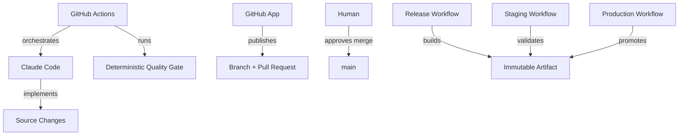

### Claude Code

Responsible for:

- implementation;
- local tests allowed by project policy;
- structured task result.

Not responsible for:

- committing;
- pushing;
- creating Pull Requests;
- merging;
- deploying Production.

### GitHub Actions

Responsible for:

- lifecycle orchestration;
- deterministic validation;
- publication;
- Release;
- Staging;
- Production;
- rollback.

### Human Operators

Responsible for:

- merging approved Pull Requests;
- approving Production deployment;
- choosing rollback targets during incidents.

---

## 5. Pull Request Publication

Automated Pull Requests are published using a GitHub App installation token.

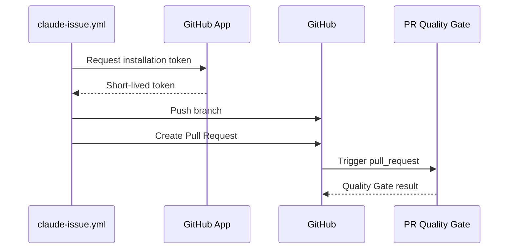

This avoids the redundant `Approve workflows to run` step that can occur when Pull Requests are created with `GITHUB_TOKEN`.

The human merge decision remains unchanged.

---

## 6. Deterministic Validation

The authoritative quality gate is:

```bash
./mvnw -B -ntp verify
```

The agent result is not authoritative.

```text
Claude says "completed"
        |
        v
External Maven verification
        |
        +--> PASS -> implementation accepted
        |
        +--> FAIL -> implementation rejected
```

This separation prevents the implementation agent from also becoming the final judge of its own output.

---

## 7. Release Architecture

```mermaid
flowchart TD
    A[main] --> B[Maven verify]
    B --> C[JAR]
    C --> D[JAR SHA-256]
    C --> E[Docker Build]
    E --> F[GHCR]
    F --> G[image@sha256 digest]

    A -. source identity .-> H[Git Commit SHA]
    H --> E
    D --> E
```

### Artifact Identities

| Identity | Purpose |
|---|---|
| Git commit SHA | Identifies source code |
| JAR SHA-256 | Identifies Java binary |
| OCI image digest | Identifies container image |
| Cloud Run revision | Identifies deployed runtime revision |

No `latest` tag is required for Production promotion.

---

## 8. Staging Architecture

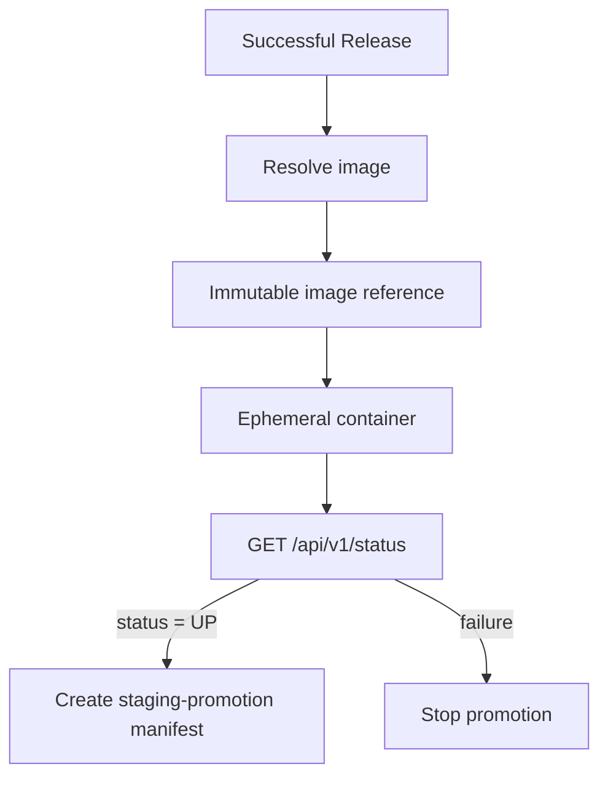

Staging does not rebuild the application.

It consumes the artifact produced by Release and produces durable promotion evidence.

### `staging-promotion`

The manifest records:

```text
release SHA
release run ID
staging run ID
image tag
immutable image reference
JAR SHA-256
```

Production consumes this evidence instead of rediscovering which artifact should be deployed.

---

## 9. Production Promotion

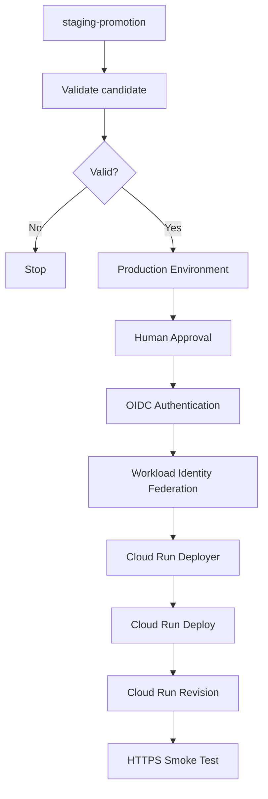

The approval is placed after candidate validation.

Therefore an operator approves a known, validated artifact rather than an unverified candidate.

---

## 10. Google Cloud Identity Architecture

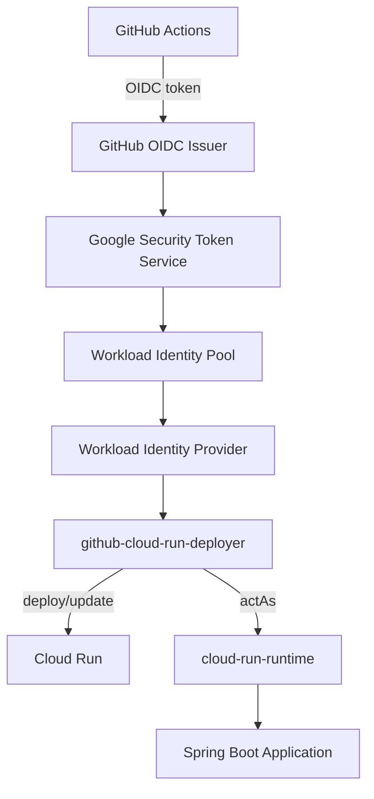

### Deployment Identity

```text
github-cloud-run-deployer@pipeline-orchestrated-prod.iam.gserviceaccount.com
```

Used only for deployment operations.

### Runtime Identity

```text
cloud-run-runtime@pipeline-orchestrated-prod.iam.gserviceaccount.com
```

Used by the application while running.

The runtime identity must not inherit deployment administration permissions.

---

## 11. Authentication and Authorization

```text
OIDC / Workload Identity Federation
    = authentication

Google IAM roles
    = authorization

GitHub production Environment approval
    = human governance
```

These mechanisms solve different problems and must remain conceptually separated.

---

## 12. Cloud Run Runtime Model

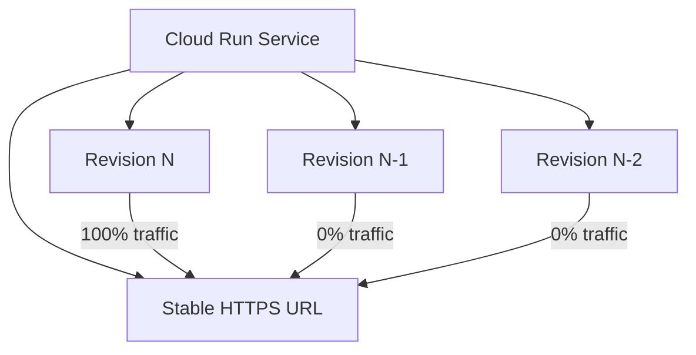

A Cloud Run revision is immutable.

Production traffic can be moved between revisions without rebuilding the application.

---

## 13. External Image Import

Cloud Run may internally import an external GHCR image.

```mermaid
flowchart LR
    A[GHCR image@sha256:A] --> B[Cloud Run Import]
    B --> C[cache.us-docker.pkg.dev/...@sha256:B]
    C --> D[Cloud Run Revision]
```

The source digest and the internal runtime digest must not be assumed to be textually identical.

### Correct Validation Model

Before deployment:

```text
immutable GHCR image
OCI source revision
JAR SHA-256
```

After deployment:

```text
Cloud Run revision exists
runtime image exists
runtime digest exists
HTTPS smoke test succeeds
```

---

## 14. Production Rollback

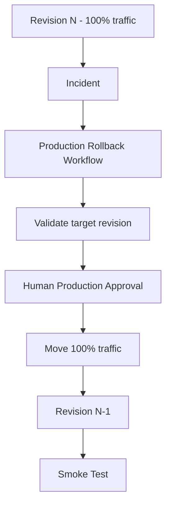

Rollback is a traffic operation, not a rebuild.

The controlled rollback workflow uses:

```text
gcloud run services update-traffic
```

This preserves traceability and avoids introducing new artifacts during incident recovery.

---

## 15. Concurrency Model

Production deployment and Production rollback share the same operational target.

Only one Production-changing workflow should execute at a time.

```text
Production operation A
        |
        | active
        v
Cloud Run

Production operation B
        |
        v
WAITING
```

This prevents race conditions between simultaneous promotions or recovery operations.

---

## 16. Failure Propagation

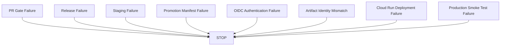

The architecture follows a fail-closed principle:

> An ambiguous or invalid state must stop the promotion.

---

## 17. Credential Boundaries

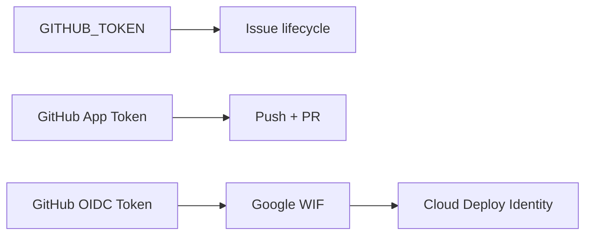

No single credential owns the entire pipeline.

This reduces blast radius and improves auditability.

---

## 18. Secrets and Variables

### Secrets

```text
CLAUDE_CODE_OAUTH_TOKEN
CLAUDE_AUTOMATION_APP_PRIVATE_KEY
```

Optional:

```text
OPENROUTER_API_KEY
```

### Variables

```text
GCP_PROJECT_ID
GCP_REGION
GCP_SERVICE_ACCOUNT
GCP_RUNTIME_SERVICE_ACCOUNT
GCP_WORKLOAD_IDENTITY_PROVIDER
GCP_CLOUD_RUN_SERVICE
CLAUDE_AUTOMATION_APP_CLIENT_ID
```

Long-lived Google Service Account JSON credentials are intentionally not used.

---

## 19. Production Evidence Chain

A Production deployment can be traced through:

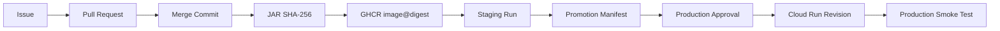

This is the release chain of custody.

---

## 20. Canonical Production Path

There must be one canonical path for product changes:

```text
Issue
→ Claude Code
→ Quality Gate
→ GitHub App
→ Pull Request
→ PR Quality Gate
→ Human Merge
→ Release
→ Staging
→ Production Candidate
→ Human Approval
→ OIDC / WIF
→ Cloud Run
```

There must also be one canonical emergency recovery path:

```text
Production incident
→ Production Rollback
→ Human Approval
→ Cloud Run traffic reassignment
→ Smoke Test
```

Alternative deployment paths should not be kept available after validation workflows are no longer needed.

---

## 21. Architectural Principles

### Least Privilege

Every identity receives only the permissions required for its responsibility.

### Separation of Duties

Implementation, validation, publication, approval, deployment, and runtime execution are separate responsibilities.

### Immutable Promotion

Staging and Production consume the same immutable release artifact.

### Short-Lived Credentials

GitHub App installation tokens and OIDC-derived Google credentials are temporary.

### Human-in-the-Loop

Humans make high-value decisions:

```text
merge into main
deploy to Production
rollback Production
```

### Deterministic Validation

Automated agents do not decide whether their own implementation is acceptable.

### Fail Closed

Unclear states block the pipeline.

### Recoverability

Cloud Run revisions and the rollback workflow provide a controlled recovery path.

### Traceability

Every critical Production state can be related back to the source change that produced it.

---

## 22. Final Architecture

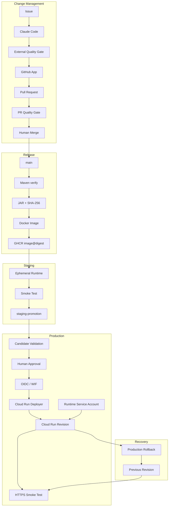

---

## 23. Core Architectural Invariant

> Production must run an artifact that was previously validated, immutably identified, explicitly approved, and operationally recoverable.

Any future architectural change should preserve this invariant unless the project deliberately replaces it with an equally strong or stronger control model.
